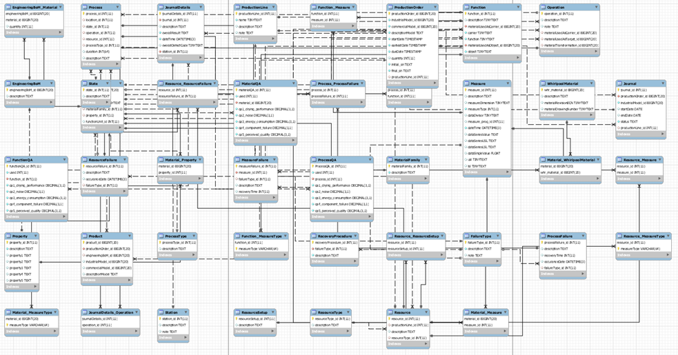
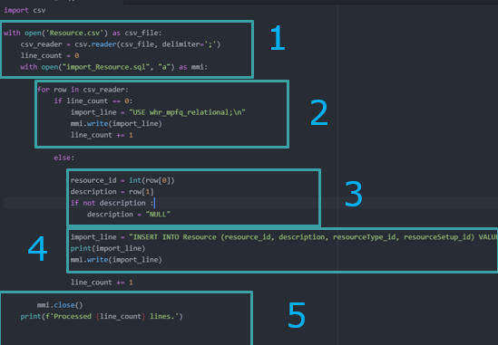

#  Q-Ontology Enabler
Q-Ontology Enabler is a set of python scripts which ease the migration to the QU4LITY relational database performing a ETL processes on existing on-premises infrastructures. The relational transposition of R-MPFQ model does not represent a new MES, but a way to organize in the most logical and structured way possible a varied reality although it may become that one day in the future.

## Contents

-   [R-MPFQ Ontology Model](#rmpfq)
-   [Install](#install)
-   [Customization](#customization)
-   [License](#license)

## R-MPFQ Ontology Model
The management of the complexity of manufacturing processes is one of the most interesting challenges in the industrial world in contiguous transformation. To do this arises the need to develop digital model able to represent reality, to process data, states and processes, and the quality trend evolution. This done through new forms of functional, logical and operational correlations.
To integrate all relevant elements that affect product and process quality, a RMPFQ-model is developed within QU4LITY Project, based on the previously developed functional models introduced in past projects (e.g.: GRACE FP7-NMP-2009-SMALL-3). The previous MPFQ model only covers the processes of assembly manufacturing covering Material, Process, Function and Quality. In QU4LITY project, pilots focusing on both machining and assembly processes are included. Therefore, the R-MPFQ model is developed by adding a Resource element.  
The definition of each element is listed as follows:

-   Manufacturing Resource, according to ISO 15531, represents the devices, tools and means, at the disposal of the enterprise to produce goods and services, but except raw material and final product components,
-   Material represents everything that is needed to produce a certain product or product component, which may include raw materials, pre-products, consumables, operating supplies, product components and assemblies,
-   Manufacturing Processes are defined as processing and transforming materials into the final goods by using machines, tools and human labour. This process is defined within the plant engineering,
-   Product Functions / Features represent the distinguished characteristics of a product item, which may include functionalities like specific tasks, actions or processes that the product is able to perform; and/or other features like performance,
-   Product Quality (Q) is defined as, according to DIN EN ISO 9000, the degree of conformance of final product functions and features to designed requirements.

# 

## Getting Started - install

Q-Ontology Enabler consists of a set of python scripts, therefore, only python 3.X compiler is required to be able to run it.

## Customization

Q-Ontology Enabler, being a set of python scripts, can be easily customized editing the source files. The most important thing to keep in mind, when customizing Q-Ontology Enabler scripts, is that it performs ETL processes, thus, only inputs haves to be modified not to break R-MPFQ Ontology compliance.
Q-Ontology Enabler scripts follow the same structure:

# 

1.	File opening
2.	CSV rows parsing loop
3.	Input Extraction and Transformation
4.	Load processing
5.	File closing
Customizing Q-Ontology Enabler scripts thus require only to properly change section 1 and 3 to fit .csv input file name and structure.

## License
QU4LITY Q-Ontology Enabler is licensed under the

GNU Affero General Public License v3.0
